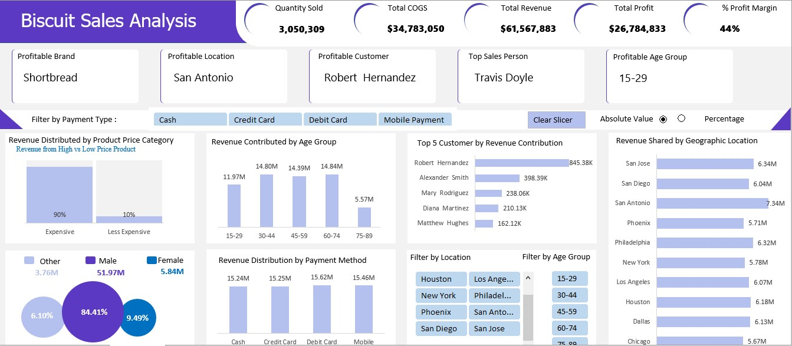
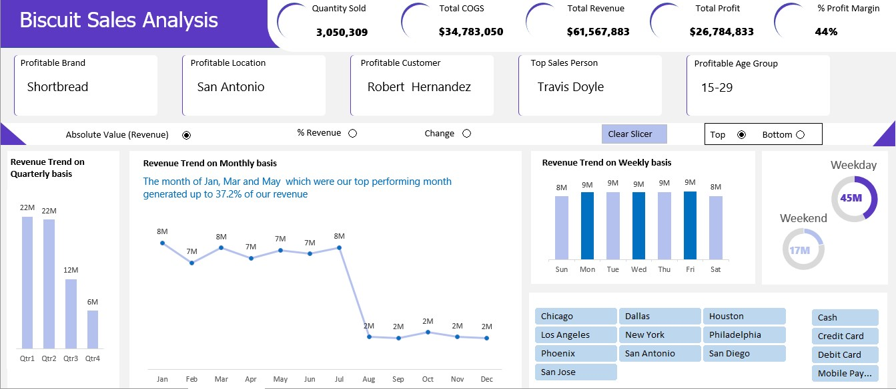

# Biscuit Sales Analysis Report

## Introduction
This report presents a comprehensive analysis of the sales performance of biscuit products, conducted using Excel for data processing and visualization. Key metrics and trends such as revenue, profit, and customer segmentation have been explored to inform decision-making processes.

## Statement of the Problem
The goal of this analysis is to uncover the key factors driving the success of biscuit sales. By analyzing product performance, customer behavior, and sales trends, we aim to identify the most profitable strategies and areas of improvement in sales performance, brand promotion, and customer targeting.

## Tools Used
- **Microsoft Excel**: Data analysis and visualization were conducted using Excel, leveraging its powerful data processing and charting capabilities.
- **Data Source**: Sales data on biscuit products over a given period.
- **Metrics Analyzed**: Quantity sold, revenue, cost of goods sold (COGS), profit margins, customer segmentation by age and location, and payment methods.

## Insights from the Analysis
### 1. Most Profitable Brand and Customer
- The most profitable brand is **Shortbread**, contributing the highest revenue.
- **Robert Hernandez** is the top customer based on revenue contributions.

### 2. Geographic Distribution of Revenue
- **San Antonio** is the highest revenue-generating location, followed by **San Jose** and **San Diego**.

### 3. Top Salesperson
- **Travis Doyle** stands out as the top-performing salesperson.

### 4. Revenue by Age Group
- The **15-29** age group is the most profitable, generating the highest revenue, followed by **30-44** and **45-59** age groups.

### 5. Revenue by Payment Method
- Payment methods are fairly distributed with **cash**, **credit card**, and **debit card** contributing similar revenue levels around $15M each.

### 6. Sales Trends
- **Quarterly Trends**: Sales peaked in **Q1** and **Q2**, with $22M each, and dropped significantly in **Q4**.
- **Monthly Trends**: January, March, and May were the best-performing months, together contributing 37.2% of annual revenue.
- **Weekly Trends**: Sales were consistent across weekdays, with **Tuesday** and **Wednesday** showing the highest revenue, while weekend sales were significantly lower.

### 7. Gender-Based Sales
- **Male customers** contributed **84.41%** of the revenue, while **female customers** contributed **9.49%**, indicating a potential area for growth.

### 8. Product Pricing Strategy
- The majority of revenue comes from **expensive products** (90%), highlighting the strong demand for premium offerings.

## Key Performance Metrics
- **Quantity Sold**: 3,050,309 units
- **Total COGS (Cost of Goods Sold)**: $34,783,050
- **Total Revenue**: $61,567,883
- **Total Profit**: $26,784,833
- **Profit Margin**: 44%

## Recommendations
### 1. Focus on High-Performing Locations
- Increase efforts in locations like **San Antonio** and **San Jose** to capitalize on their revenue potential.

### 2. Expand Target Audience among Younger Demographics
- The **15-29** age group is highly profitable. Marketing strategies should focus on retaining and expanding this segment.

### 3. Boost Weekend Sales
- Weekends show lower sales compared to weekdays. Implement weekend-specific promotions to boost sales during these periods.

### 4. Improve Female Customer Engagement
- Given the lower revenue from **female customers**, introducing targeted campaigns or expanding product variety for this demographic could improve sales.

### 5. Maintain Focus on Premium Products
- Since 90% of the revenue comes from premium products, efforts to enhance and promote high-end offerings should continue. However, strategies to increase the market for less expensive products should also be considered.

### 6. Address Seasonal Declines
- Sales drop significantly in **Q3** and **Q4**. Introducing seasonal promotions or limited-time offers during these periods can help maintain consistent revenue throughout the year.

!
